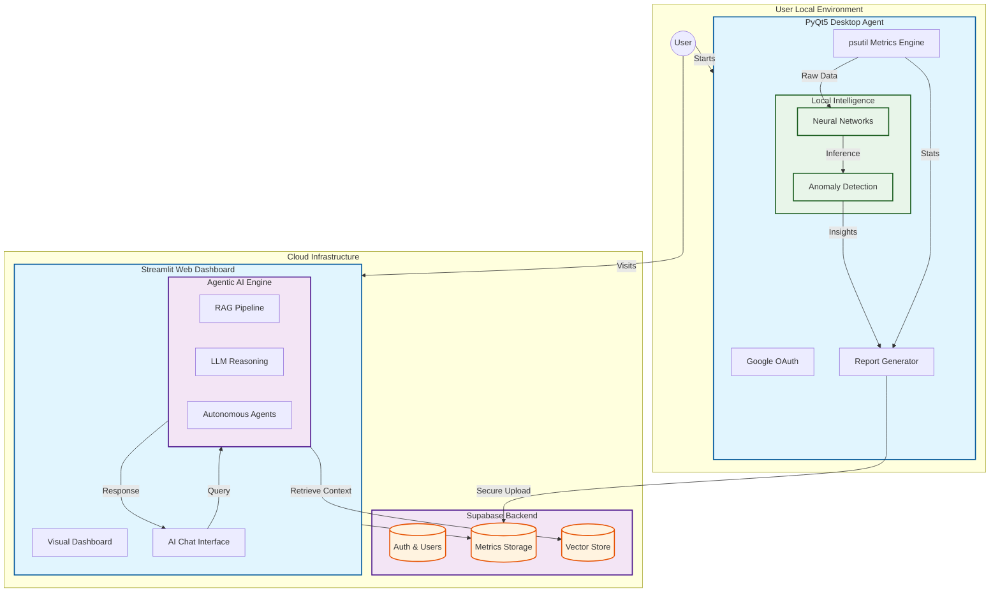

# System Architecture

This project implements a **distributed intelligent diagnostics platform** combining system-level monitoring, machine learning, agentic AI, retrieval-augmented generation (RAG), and full-stack web technologies.

The system is architected into **two tightly coupled applications**:

- **Desktop System Agent (PyQt5)** – responsible for hardware-level data collection, ML inference, and secure reporting.
- **Web Dashboard (Streamlit)** – responsible for visualization, AI-powered diagnostics, and cloud-based analytics.

---

## High-Level Architecture

---

## Architectural Principles

### 1. Separation of Concerns

The system separates responsibilities between:

- **Local System Intelligence**
- **Cloud-based AI Reasoning**
- **Persistent Storage & Authentication**

This ensures:
- Security
- Scalability
- Platform independence
- Modularity

---

### 2. Dual Application Design

#### Desktop System Agent (PyQt5)

The desktop agent is responsible for **hardware-sensitive operations**, which are not possible inside browser-based applications due to sandboxing and security constraints.

Responsibilities:

- Secure Google OAuth authentication
- Real-time system metric collection using `psutil`
- Local ML inference using trained neural networks
- Structured health report generation
- Secure upload of reports to Supabase

The desktop client acts as a **trusted system sensor and intelligence node**.

---

#### Web Dashboard (Streamlit)

The web application provides:

- Cloud-based visualization
- Historical report analysis
- AI-powered diagnostics chatbot
- Interactive dashboards

Responsibilities:

- Secure OAuth login
- Supabase data access
- RAG pipeline execution
- LLM-powered conversational diagnostics
- UX-focused interface design

---

## Data Flow Pipeline

### Step 1 — Metric Collection (Desktop)

System metrics are collected using `psutil`, including:

- CPU utilization and frequency
- Memory usage
- Disk usage and I/O
- Network activity
- Temperature sensors (when available)
- Active process statistics

---

### Step 2 — Local ML Inference

Collected metrics are passed into **trained neural classifiers** that perform:

- Real-time anomaly detection
- Subsystem classification:
  - CPU + Memory
  - Disk
  - Network
  - Temperature

This enables **immediate local detection of suspicious system behavior**.

---

### Step 3 — Agentic Intelligence Engine

ML outputs are combined with:

- Statistical heuristics
- Domain-driven threat signatures
- Multi-dimensional risk scoring

The system performs:

- Cryptojacking detection
- Data exfiltration detection
- Thermal abuse analysis
- Sustained workload profiling
- Root cause process attribution

This hybrid architecture combines:

> **Neural Intelligence + Rule-based Expert Systems**

---

### Step 4 — Structured Report Generation

A comprehensive health report is generated containing:

- Global threat index
- Subsystem anomaly breakdown
- Root cause processes
- Aggregate window analysis
- Predictive system forecasts

This structured format enables seamless cloud analysis and AI interpretation.

---

### Step 5 — Secure Cloud Synchronization

Reports are uploaded to Supabase using secure API access.

Supabase provides:

- Authentication mapping
- Report storage
- Chat history storage
- Full CRUD support

---

### Step 6 — AI Reasoning & RAG

The Streamlit web application integrates:

- Vector database powered RAG pipeline
- OS-specific contextual knowledge bases
- Generative LLM chatbot

This allows:

- Context-aware diagnostics
- Explainable system health insights
- OS-tailored optimization guidance

---

## AI System Design

### Generative AI

- LLM-based conversational diagnostics
- System health explanation
- Actionable optimization guidance

---

### Agentic AI

- Autonomous threat reasoning
- Root cause inference
- Predictive trend modeling
- Decision fusion across subsystems

---

### Machine Learning Layer

- Neural classifiers for:
  - CPU + memory anomalies
  - Disk anomalies
  - Network anomalies
  - Thermal anomalies
- Encoders for feature extraction
- Supervised training on synthetic + real workload profiles

---

## Why This Architecture Matters

This system replicates **real-world observability and cybersecurity architectures** used in:

- Enterprise monitoring platforms
- Endpoint detection systems (EDR)
- Cloud telemetry analytics
- Predictive maintenance systems

By integrating:

- Desktop-level sensing
- Cloud-scale AI reasoning
- Hybrid intelligence models

the project achieves **industrial-grade system diagnostics capabilities**.

---

## System Capabilities Summary

| Layer | Capability |
|---------|-------------|
| Desktop | Real-time monitoring + ML inference |
| Backend | Secure storage + authentication |
| AI | Generative + Agentic + RAG |
| Web | Visualization + conversational diagnostics |
| ML | Trend modeling + anomaly classification |

---

This architecture enables **scalable, secure, and intelligent system diagnostics across platforms**.
