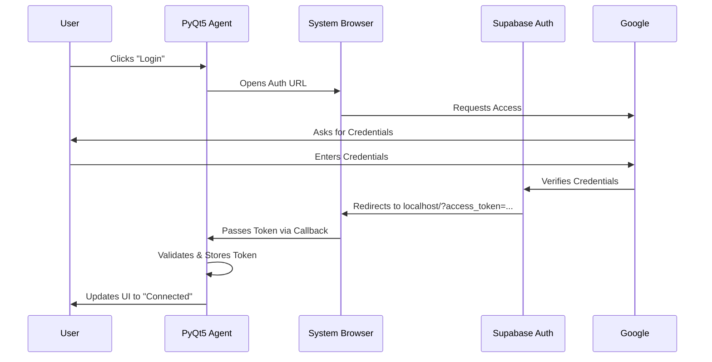

# Authentication (Google OAuth)

Authentication in the Desktop Agent is handled via **Google OAuth 2.0**, managed through the Supabase Auth infrastructure.

To ensure maximum security and compliance with Google's security protocols, the application utilizes the **System Browser Flow** (Loopback Interface) rather than an embedded web view.

---

## 🔐 The Authentication Strategy

We purposefully avoid entering credentials directly into the PyQt5 application. Instead, we delegate authentication to the user's trusted default browser (Chrome, Edge, Firefox, etc.).

**Why this approach?**
1.  **Security:** The application never sees the user's password.
2.  **Trust:** Users log in via the familiar Google SSL interface.
3.  **Compliance:** Google blocks OAuth requests from embedded webviews (like `QWebEngineView`) to prevent phishing attacks.

---

## 🔄 The Login Workflow

The authentication process follows a strict sequence:

1.  **Initiation:** The user clicks "Login with Google" in the PyQt5 app.
2.  **Redirect:** The app launches the system's default web browser with a specific Supabase OAuth URL.
3.  **Consent:** The user signs in with their Google account in the browser.
4.  **Callback:** Upon success, Google redirects the browser to a local callback server running on the user's machine (e.g., `http://localhost:3000/callback`).
5.  **Token Exchange:** The PyQt5 app listens for this callback, captures the **Access Token** and **Refresh Token**, and closes the browser tab.
6.  **Persistence:** Tokens are securely stored locally for future sessions.

### Sequence Diagram

## 🛠 Technical Implementation
The implementation relies on the Supabase Python SDK (gotrue-py) and a local socket listener.

1. Generating the Auth URL
The application requests a provider URL from Supabase, specifying the scope to access basic profile information (email, name, avatar).

2. The Local Callback Listener
To capture the token returning from the browser, the desktop application spins up a temporary local TCP server.

Port: Randomly assigned or fixed (e.g., 3000).

Behavior: Listens for a single HTTP GET request containing the authentication fragment, parses the URL parameters, and then shuts down immediately to free resources.

3. Session Management
Once authenticated, the access_token and refresh_token are stored securely.

Access Token: Used to authenticate API requests (uploading metrics, fetching configs). Expires after 1 hour.

Refresh Token: Used to silently acquire a new Access Token without asking the user to log in again.

## 🛡 Security Considerations
Token Storage: Tokens are never stored in plain text files. They are encrypted using OS-specific secure storage (e.g., Windows Credential Manager or GNOME Keyring) where possible.

Scope Limitation: The app requests only the minimum required permissions (public profile), ensuring user privacy.

State Verification: A unique state parameter is passed during the OAuth flow to prevent CSRF (Cross-Site Request Forgery) attacks.