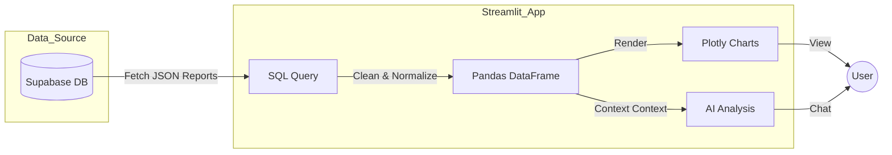

# Web Dashboard (Streamlit)

The **Web Dashboard** is the cloud-native command center of the System Health AI platform. Built using **Streamlit**, it acts as the centralized interface where users can visualize historical telemetry, interact with the AI diagnostics agent, and manage their account settings.

While the Desktop Agent focuses on *collection and immediate detection*, the Web Dashboard focuses on *long-term analysis, explanation, and interaction*.

---

## 🎯 Core Responsibilities

The Web Application serves three distinct purposes in the architecture:

1.  **Data Visualization & Analytics**
    It retrieves the structured reports uploaded by the Desktop Agent from Supabase and renders them into interactive, time-series visualizations. This allows users to see trends over days, weeks, or months—something the lightweight desktop agent is not designed to do.

2.  **The AI Command Hub**
    It hosts the **Generative AI** and **Agentic** components. Because Large Language Models (LLMs) and RAG pipelines require significant compute resources (or API calls), they reside here in the cloud application rather than burdening the user's local machine.

3.  **Cross-Device Accessibility**
    Being a web app, it allows a user to check the health status of their home PC from a phone, laptop, or any other device with a browser.

---

## 🏗 Tech Stack & Reasoning

| Component | Technology | Reasoning |
| :--- | :--- | :--- |
| **Framework** | **Streamlit** | Python-native framework ideal for data science apps. Allows rapid integration of ML models and plotting libraries (Altair/Plotly) without complex frontend boilerplate. |
| **Backend** | **Supabase** | Acts as the "Backend-as-a-Service," providing the database, auth, and vector store that Streamlit connects to. |
| **Auth** | **Google OAuth** | Unified single-sign-on (SSO) ensuring the web user matches the desktop user. |
| **AI Engine** | **LangChain / LlamaIndex** | Orchestrates the RAG pipeline and agentic workflows within the Streamlit session. |

---

## 🖥 Dashboard Structure

The application is organized into several key pages:

* **Home / Overview:** A high-level status board showing the most recent health scores from all connected devices.
* **Analytics Deep Dive:** Detailed interactive charts for CPU, Memory, and Thermal history. Users can filter by date ranges to correlate system crashes with specific metrics.
* **AI Diagnostics (Chat):** The conversational interface where users ask, *"Why did my PC crash yesterday?"* and receive answers grounded in their actual system logs.
* **Settings:** Management of data retention policies and account details.

---

## 🔄 Data Flow: From Sensor to Screen

Unlike the Desktop App, the Web Dashboard **does not** collect live metrics from the machine it is running on. Instead, it acts as a **Viewer** for the Supabase database.

## 🚀 Why Streamlit?
Traditional web frameworks (React, Vue) require separate backend APIs (FastAPI/Flask) to serve data. Streamlit allows us to build a full-stack data application entirely in Python.

This reduces development complexity and ensures that the Machine Learning engineers building the predictive models can also build the User Interface without context switching between languages.